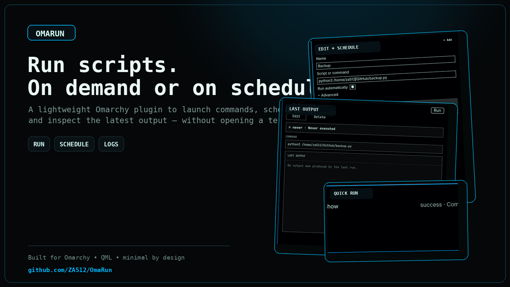
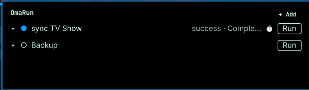
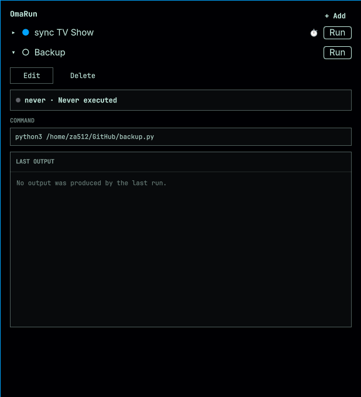
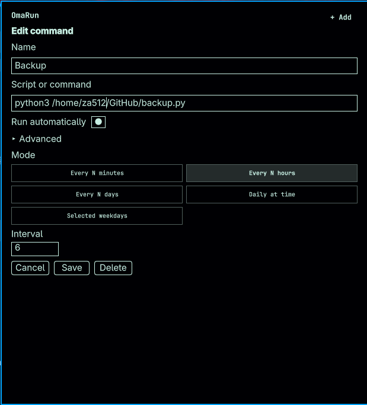
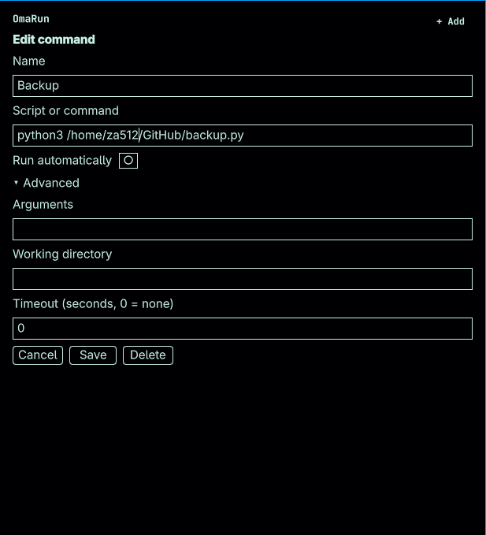
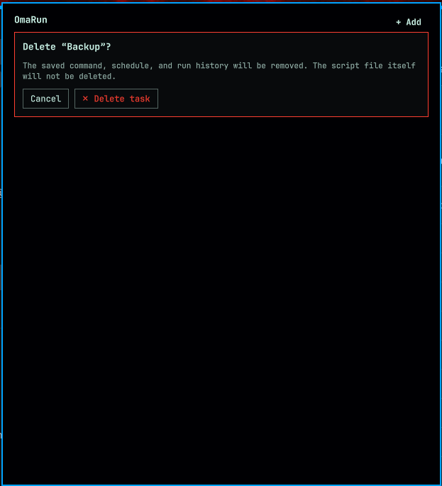

# OmaRun

Run scripts from the Omarchy bar — on demand or on a schedule — and inspect their latest output without opening a terminal.



OmaRun is a lightweight, theme-aware bar widget for Omarchy Quattro. It keeps the interface intentionally small while using native `systemd --user` services and timers underneath.

## Features

- Save, edit, run, stop, and delete personal commands.
- Schedule commands every N minutes, hours, or days, at a daily time, or on selected weekdays.
- See running, successful, failed, stopped, and timed-out states at a glance.
- Follow the current output while a command is running and inspect the last output afterward.
- Configure arguments, a working directory, environment variables through the CLI, and an optional timeout.
- Prevent overlapping runs of the same task.
- Match the active Omarchy theme and font automatically.
- Run entirely as the current user: no root service, `sudo`, cron daemon, or external Python package is required.

## Screenshots

| Task list | Run details and output |
| --- | --- |
|  |  |

| Scheduling | Advanced options |
| --- | --- |
|  |  |

| Safe deletion |
| --- |
|  |

## Requirements

- Omarchy 4 (Quattro) or newer.
- A working per-user systemd manager, provided by a normal Omarchy installation.
- Python 3. OmaRun uses only the Python standard library.

## Install

```sh
omarchy plugin add https://github.com/ZA512/OmaRun.git --enable
```

The widget defaults to the right section of the bar. Move it at any time with:

```sh
omarchy bar move io.github.mgirard.omarun --section right
```

## Usage

1. Open OmaRun from the `>_` widget in the bar.
2. Select **Add**, give the task a name, and enter any executable or command available to your user.
3. Optionally enable automatic execution and select a schedule.
4. Save the task, then use **Run** whenever you want an immediate execution.
5. Expand the task to inspect its status, command, and current or latest output.

The **Advanced** section lets you provide separate arguments, a working directory, and a timeout. A timeout of `0` means no timeout.

### Command ideas

OmaRun is not limited to Python. It can launch system commands, command-line applications, executable scripts, or interpreters for any language installed on the machine.

| Use case | Example command |
| --- | --- |
| Check disk usage and keep the result | `df -h` |
| Inspect memory usage | `free -h` |
| Restart a user service | `systemctl --user restart syncthing.service` |
| Update Flatpak applications without prompts | `flatpak update --noninteractive` |
| Fast-forward a local Git checkout | `git -C /home/you/dotfiles pull --ff-only` |
| Copy documents to an external disk or NAS | `rsync -a /home/you/Documents/ /mnt/backup/Documents/` |
| Back up a directory with Restic | `restic backup /home/you/Documents` |
| Synchronize files with Rclone | `rclone sync /home/you/Pictures remote:Pictures` |
| Run a shell script | `bash /home/you/scripts/backup.sh` |
| Run a Python utility | `python3 /home/you/scripts/organize-media.py` |
| Run a Node.js utility | `node /home/you/scripts/check-feeds.mjs` |

Some examples require the named tool and its configuration to already exist. Replace paths, remotes, and service names with your own before running them.

OmaRun becomes especially useful for small personal scripts that:

- back up important folders and prune old archives;
- organize downloads, photos, music, or TV libraries;
- synchronize a workstation with a NAS, server, or cloud remote;
- export a database before maintenance;
- check disk space, local services, or backup health and leave a readable report;
- rebuild documentation, a static site, thumbnails, or media indexes;
- fetch a feed or API snapshot for later processing;
- perform repetitive project housekeeping across several repositories.

Prefer non-interactive commands. OmaRun has no terminal in which to answer a password or confirmation prompt, so full system upgrades such as `omarchy update` are generally better launched from a terminal. If a tool supports flags such as `--noninteractive`, `--yes`, or `--force`, use them only after checking exactly what they will do.

### Keyboard controls

When the task list has focus:

| Key | Action |
| --- | --- |
| `↑` / `↓` | Select a task |
| `Enter` | Expand or open the selected task |
| `Space` | Run or stop the selected task |
| `N` or `A` | Add a task |
| `E` | Edit the expanded task |
| `Escape` | Go back, cancel a confirmation, or close the panel |

## Scheduling: systemd, not cron

OmaRun never writes to a crontab. Every saved task gets a user service, and an optional schedule gets a matching user timer:

```text
OmaRun QML panel
      │
      ▼
backend/omarunctl.py
      │
      ├── ~/.config/systemd/user/omarun-<task-id>.service
      │                         ▲
      └── optional .timer ──────┘
                │
                ▼
         backend/runner.py
                │
                ├── current.log / last.log
                └── status.json
```

Manual and scheduled runs activate the same `.service`, so they share the same execution, timeout, status, and logging behavior. The timer is only the trigger.

The schedule presets translate to these systemd timer concepts:

| OmaRun schedule | systemd timer |
| --- | --- |
| Every N minutes/hours/days | `OnActiveSec=` + `OnUnitActiveSec=` |
| Daily at a time | `OnCalendar=` |
| Selected weekdays at a time | `OnCalendar=` |

Calendar timers use `Persistent=true`. If the user manager was not running when a calendar event was due, systemd can perform one catch-up activation when the timer becomes active again. This is similar to simple anacron behavior, but it is not a replay of every missed occurrence.

For interval schedules, `OnActiveSec=` establishes the first run relative to the moment the timer is enabled. `OnUnitActiveSec=` then schedules subsequent runs relative to the previous service activation. No manual bootstrap run is required.

Why use systemd timers here?

- The schedule and the process lifecycle are managed by the same user service manager.
- A task can be started and stopped cleanly with `systemctl --user`.
- systemd prevents the timer from starting another copy while its service is already active.
- Calendar schedules understand the system clock and timezone.
- The task continues independently of whether the OmaRun panel is open.

For diagnostics, you can inspect generated units with:

```sh
systemctl --user list-timers 'omarun-*' --all
systemctl --user list-units 'omarun-*' --all
```

See [`systemd.timer(5)`](https://man.archlinux.org/man/systemd.timer.5.en) for the timer semantics used by OmaRun.

## Current limitations

OmaRun is designed as a small personal script runner, not a complete cron replacement or a general systemd administration interface.

- **Schedules belong to the user session.** The per-user systemd manager normally starts at login and may stop after logout unless lingering is configured for the account.
- **It does not wake a suspended or powered-off computer.** Calendar timers can catch up once after the user manager returns, but monotonic interval timers pause during suspend and do not replay missed intervals.
- **Timer precision is systemd's default.** OmaRun does not override `AccuracySec=`, whose systemd default permits coalescing timer events within a one-minute window.
- **Only the current and most recent output are kept.** Standard output and standard error are merged in order. There is no run-history browser, log rotation, or output-size limit yet.
- **Commands are not interpreted by a shell.** OmaRun builds an argument vector with `shlex` and starts it directly. Pipes, redirects, `&&`, glob expansion, and shell variables therefore have no implicit meaning. When shell syntax is intentional, invoke a shell explicitly, for example with command `bash -lc` and a quoted expression in **Arguments**.
- **Scheduling is preset-based.** Complex calendar expressions, monthly schedules, dependencies between tasks, retries, and notifications are not available yet.
- **One instance per task.** A second run is rejected while the same task is already active.

## Files and data

OmaRun stores only local files:

```text
~/.config/omarun/tasks.json
~/.local/state/omarun/tasks/<task-id>/status.json
~/.local/state/omarun/tasks/<task-id>/current.log
~/.local/state/omarun/tasks/<task-id>/last.log
~/.config/systemd/user/omarun-<task-id>.service
~/.config/systemd/user/omarun-<task-id>.timer
```

Deleting a task from OmaRun stops its service, disables its timer, removes the generated units, and deletes that task's OmaRun status and logs. It never deletes the script or executable referenced by the task.

## Security model

Omarchy plugins run unsandboxed with your user permissions. OmaRun does not request elevation and never adds `sudo` automatically, but every command you save has the same access to your files and session as if you launched it yourself.

Review scripts before adding them. OmaRun itself makes no remote requests and executes commands without an implicit shell, which avoids accidental shell expansion but is not a security boundary.

## Update

```sh
omarchy plugin update io.github.mgirard.omarun --yes
```

## Remove

Before removing the plugin, delete its tasks from the OmaRun interface. This cleanly stops their services and removes their timers and generated unit files. Your actual script files are left untouched.

Then remove the plugin:

```sh
omarchy plugin remove io.github.za512.omarun --yes
```

The empty `~/.config/omarun/` directory may remain so a later installation can reuse it.

## Development

Validate the plugin manifest and run the backend integration tests:

```sh
omarchy plugin validate .
python3 -m unittest discover -s tests -v
```

If `qmllint` is installed:

```sh
qmllint -I "$OMARCHY_PATH/shell" \
  BarWidget.qml \
  Panel.qml \
  components/*.qml
```

## License

[MIT](LICENSE)
